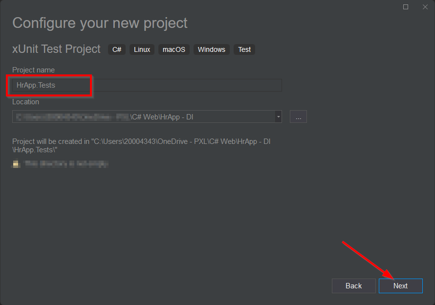

# HrApp - Dependency Injection

- AuthenticationService met SignIn, SignOut en Register methods
    - AuthenticationResult klasse voor communicatie tussen controller en service
- EmployeeRepository voor database operaties van employees

## Unit tests
- Voeg een unit test toe om de Index methode van de EmployeeController te testen

### Nuget
- [Moq](https://github.com/devlooped/moq)
- [Bogus](https://github.com/bchavez/Bogus)

### Code
#### EmployeeControllerTest
    using HrApp.Controllers;
    using HrApp.Models;
    using HrApp.Tests.Mocks;
    using Microsoft.AspNetCore.Mvc;

    namespace HrApp.Tests.Controllers
    {
        public class EmployeeControllerTest
        {
            [Fact]
            public async void Index_ReturnsAllEmployees()
            {
                //arrange
                int numberOfEmployees = 3;
                var mockPieRepository = RepositoryMocks.GetEmployeeRepository(numberOfEmployees);

                var employeeController = new EmployeeController(mockPieRepository.Object);

                //act
                var result = await employeeController.Index();
    
                //assert
                var viewResult = Assert.IsType<ViewResult>(result); //The returning type is a ViewResult
                var listOfEmployees = Assert.IsAssignableFrom<IEnumerable<Employee>>(viewResult.ViewData.Model); //The model returned is a list of employees
                Assert.Equal(numberOfEmployees, listOfEmployees.Count()); //All employees are returned 
            }
        }
    }

#### RepositoryMocks
    using Bogus;
    using HrApp.Models;
    using HrApp.Repositories;
    using Moq;

    namespace HrApp.Tests.Mocks
    {
        public static class RepositoryMocks
        {
            public static Mock<IEmployeeRepository> GetEmployeeRepository(int numberOfEmployees)
            {
                int fakeId = 0;
                var faker = new Faker<Employee>()
                    .StrictMode(true)
                    .RuleFor(e => e.EmployeeId, f => fakeId++)
                    .RuleFor(e => e.FirstName, f => f.Name.FirstName())
                    .RuleFor(e => e.LastName, f => f.Name.LastName());
    
                var employees = new List<Employee>();
                for(int i = 0; i<numberOfEmployees; i++)
                {
                    employees.Add(faker.Generate());
                }
    
                var mock = new Mock<IEmployeeRepository>();
    
                mock.Setup(repo => repo.GetAll()).ReturnsAsync(employees);
    
                return mock;
            }
        }
    }

